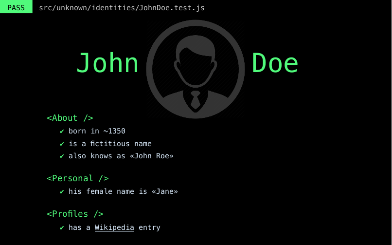

# WIP: resume-like-a-test
A simple script to generate a basic resume themed as JavaScript test output.

## Why?

Because while I was making and running a few tests for a React component the
idea came to my mind.

## But...

Yes, I know. There are a lot of (and better) tools to do a resume, such as
[JSON Resume](https://jsonresume.org/) or [HackMyResume](https://github.com/hacksalot/HackMyResume).

But, I wanted to do something by myself.

## Ok, why JavaScript?

Actually, I wanted to do it in Ruby with the only purpose to try
[HexaPDF](https://github.com/gettalong/hexapdf). But after reviewing its API I
found it a little difficult to have something in a short period of time.

Then, I saw [jsPDF](https://github.com/MrRio/jsPDF) and
[PDFKit](https://github.com/devongovett/pdfkit) and I chose this last one.

## How

Creating a PDF from a YAML file.

## Some links

- [Pdfkit](https://github.com/devongovett/pdfkit)
- [yaml-js](https://github.com/connec/yaml-js)
- [standard JS](http://standardjs.com/index.html)

## TODO

- Simplify the configuration (and also remove unnecessary getters)
- Add a footer
